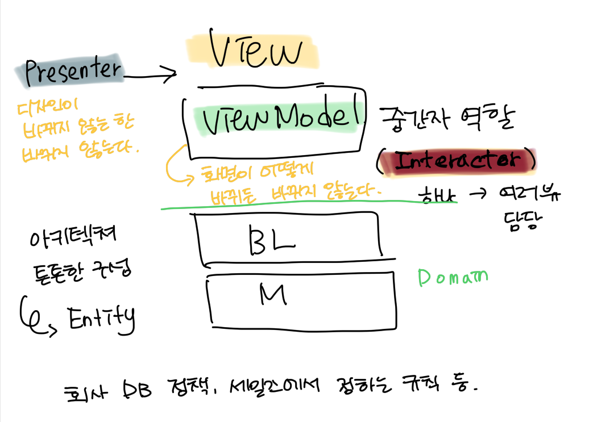
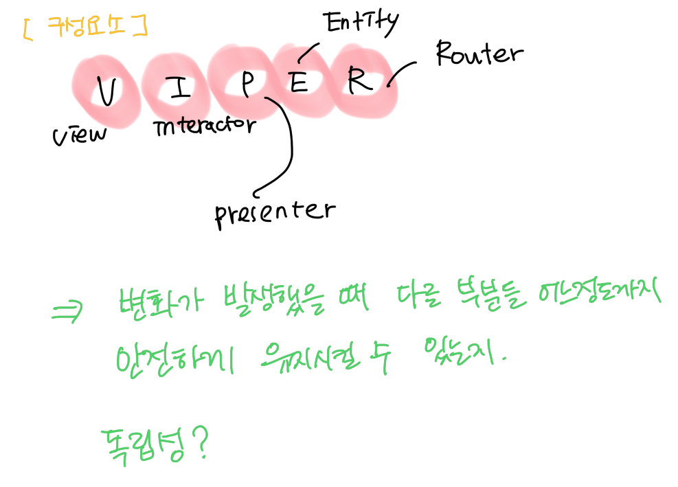

> 내용을 정리하기 앞서..

MVC 패턴은 들어봤었는데, MVVM 패턴은 뭘까? 개념도 코드에 적용도 할 수 없었기에 기초부터 배워보고 싶었다. 

<!-- {: width="100" height="100"}
{: width="100" height="100"} -->
<br>
<div display="block">


</div>

<br>

<br>

## **MVVM**
모델, 뷰, 뷰모델 패턴은 UI 와 도메인 사이의 깔끔한 관심사의 분리를 제공한다. 클린 아키텍처와 함께 사용하면 프리젠테이션 레이어와 UI 레이어 간의 문제를 분리하는 데 도움이 된다. 동일한 ViewModel 과 함께 다양한 뷰 구현을 사용할 수 있다.
<br>

### MVVM 의 장점 

- 동일한 ViewModel 과 함께 다양한 뷰 구현을 사용할 수있음.
- 하나의 UIKit 의 View 와 SwiftUI 의 다른 View를 구현할 수 있음.

> 구성 

- View(UI Layer)
- ViewModel(Presenter Layer)
- Domain Use Case(Domain Layer)
- Data Repository(Data Layer)

## Data Flow 
1. View(UI) 는  ViewModel(Presenter) 로 부터 메소드를 호출한다.
2. ViewModel 은 Use Case를 실행한다.
3. Use Case는 사용자와 저장소로부터 Data 를 결합한다.
4. 각 저장소는 원격 데이터(네트워크), 영구 DB 스토리지 소스 또는 메모리 내 데이터( 원격 또는 캐시됨)에서 데이터를 반환한다.

## Dependency Direction ( 종속성 방향 )

**`Presentation Layer` -> `Domain Layer` <- `Data Repositories Layer`**

***Presentation Layer (MVVM)** = ViewModels(Presenters) + Views(UI)*

***Domain Layer** = Entities + Use Cases + Repositories Interfaces*

***Data Repositories Layer** = Repositories Implementations + API(Network) + Persistence DB*

> 용어 알고 가기 
> Use Case

**유스케이스의 예시 유스케이스(use case)는 행위자(actor)가 관심을 가지고 있는 유용한 일을 달성하기 위한 시나리오의 집합을 명시한다**
(ex. 음료 자판기의 유스케이스: "콜라 사기" / 시나리오: "재고없음", "금액이 맞지 않음" 등)
 **Use Case(유스케이스; 사용사례)**
- 사용자, 외부 시스템, 다른 요소들이 시스템과 상호 작용하는 방법을 기술한 설명
- 시스템 사용에 대한 시나리오의 집합
- 사용자의 요구사항을 알아내는 과정
- 사용자의 시점에서 시스템을 모델링 하는 역할
 **유스케이스는 시스템을 사용하는 사용자에게서 정보를 얻어내는데 매우 유용하다**

- 누가(who) 시스템을 사용할 것인가?
- 시스템을 사용자를 위해 무엇(what)을 해야 하는가?
- 사용자와 상호작용하기 위해 시스템이 제공해야 할 인터페이스(Interface)는 무엇인가?
> Entity

엔터티(Entity)를 그대로 번역하면 실제, 독립체라는 뜻으로 데이터 모델링에서 사용되는 객체


→ 정보는 항목 목록을 표기하는 View(UI)로 다시 흐른다.

> MVVM 존재 이유

**UI 는 비즈니스 로직이나 애플리케이션 로직( 비즈니스 모델 및 유스케이스) 에 액세스할 수 없으며, 
ViewModel만 액세스 할 수있다.이것이 관심사의 분리다. 비즈니스 모델을 뷰(UI)에 직접 전달할 수 없다.**

### 그래서 비즈니스 모델을 ViewModel 내부에 맵핑하고 View 에 전달하는 이유다.

### **Data Binding**
Closure, Delegate 또는 Observable 한 항목들을 RxSwift 같은 라이브러리를 사용해 View 와 ViewModel 간 데이터 바인딩을 시켜준다. Combine 과 SwiftUI 에서도 사용할 수 있으나, 최소 iOS 13 이상은 되어야한다. ViewModel에서 View에 대한 참조는 직접적이지 않다.

```Swift
public final class Observable<Value> {
    
    private var closure: ((Value) -> ())?

    public var value: Value {
        didSet { closure?(value) }
    }

    public init(_ value: Value) {
        self.value = value
    }

    public func observe(_ closure: @escaping (Value) -> Void) {
        self.closure = closure
        closure(value)
    }
}
```

## **MVVM과 Clean Architecture 의 차이**
 물론 MVVM과 클린 아키텍처는 별도로 사용할 수 있으나, MVVM은 프리젠테이션 레이어 내부에서만 관심사를 분리한다. 
 반면,클린 아키텍처는 코드를 쉽게 테스트하고 재사용하고 이해할 수 있는 모듈식 레이어로 분할할 때 사용한다고 한다.
 
 - 클린 아키텍처는 (Test Driven Development) TDD와 정말 잘 어울린다고 한다. 이 아키텍처는 프로젝트를 테스트 가능하게 만들고 레이어를 쉽게 교체할 수 있다(UI 및 데이터).

### **소프트웨어 엔지니어에게 가장 좋은 습관**

- 테스트 없이 코드 작성하지마라 -> TDD 시도 
  
  => 개인적인 내 생각으로는 기능 구현을 하거나, 개발 데드라인에 따라 항상 적용하기는 어려울 것 같다.

- 지속적인 리팩토링 수행, 과도하게 기능적이지 말고, 실용적이어야한다.
-  가능한 한 프로젝트에서 타사 프레임워크 종속성을 사용하는 것을 지양한다.
<br>

> 참고문서
> 
>- [Clean Architecture and MVVM on iOS](https://tech.olx.com/clean-architecture-and-mvvm-on-ios-c9d167d9f5b3 "Clean Architecture and MVVM on iOS")<br>
>- [NHN Forward 22](https://youtu.be/g6Tg6_qpIVc?si=EowR93uiRYmcYwxA "NHN Forward 22")